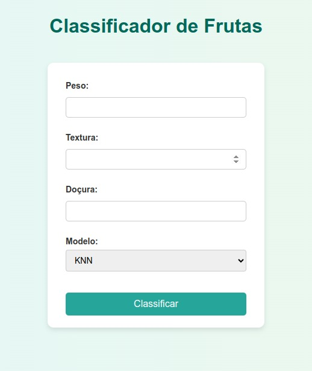
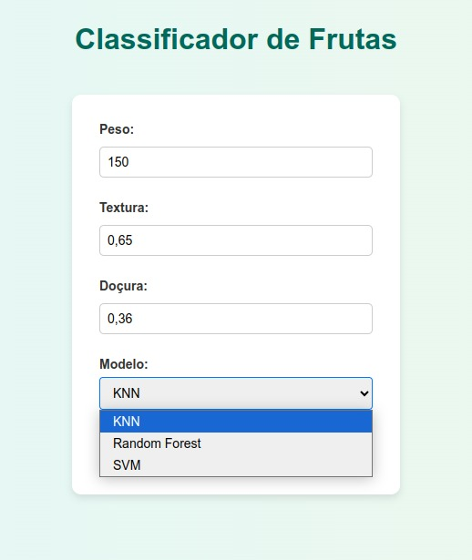
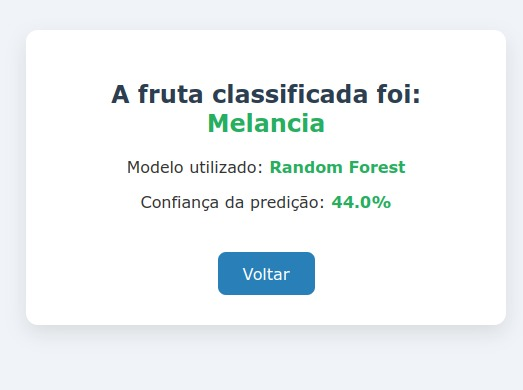

````markdown
# 🍎 Classificação de Frutas com Modelos de Machine Learning

Este projeto apresenta um pipeline completo para **classificação de frutas usando Machine Learning com Python**.

Ele inclui:

- ✅ Geração de um dataset fictício e tratado (peso, textura, doçura etc.)
- ✅ Treinamento de 3 modelos: **KNN**, **Random Forest** e **SVM**
- ✅ Avaliação de desempenho dos modelos
- ✅ Backend em **Flask** com formulário para previsão interativa
- ✅ Visualização dos resultados com **confiança da predição em porcentagem**

---

## 🔧 Tecnologias Utilizadas

- Python 3.x  
- scikit-learn  
- Flask  
- matplotlib / seaborn  
- Jupyter Notebook  

---

## 📁 Estrutura do Repositório

```plaintext
/
├── app.py                 # Código backend Flask
├── modelos.pkl            # Modelos treinados serializados
├── notebook.ipynb         # Notebook com todo o pipeline de ML
├── templates/             # Templates HTML para a aplicação Flask
│   ├── index.html
│   └── result.html
├── static/                # Arquivos estáticos (CSS, JS)
│   └── style.css
├── img/                   # Imagens das telas do sistema
│   ├── tela_formulario.png
│   └── tela_resultado.png
└── README.md              # Este arquivo
````

---

## ▶️ Como Usar

### 1. Clonar o Repositório

```bash
git clone https://github.com/karython/seu-repositorio.git
cd seu-repositorio
```

### 2. Instalar Dependências

Recomenda-se usar um ambiente virtual:

```bash
python -m venv venv
source venv/bin/activate  # Linux/macOS
venv\Scripts\activate     # Windows

pip install -r requirements.txt
```

> *Se ainda não houver um `requirements.txt`, crie-o com:*

```bash
pip freeze > requirements.txt
```

### 3. Rodar o Notebook

Abra o `notebook.ipynb` no Jupyter para explorar a criação do dataset, o treinamento dos modelos e as análises gráficas.

### 4. Rodar o Backend Flask

```bash
python app.py
```

Acesse o sistema no navegador:

🔗 [http://127.0.0.1:5000](http://127.0.0.1:5000)

Preencha o formulário, escolha o modelo e veja a fruta classificada com a **confiança da predição em porcentagem**.

---

## 📸 Prints do Sistema
### 1. Página Inicial


### 2. Modelos


### 3. Resultado da Predição



## 📬 Contato

Se tiver dúvidas, sugestões ou quiser contribuir:

* 📧 [karython.unai@gmail.com](mailto:karython.unai@gmail.com)
* 🐙 GitHub: [@karython](https://github.com/karython)

---

## 📄 Licença

Este projeto está licenciado sob a **MIT License**. Veja o arquivo [LICENSE](LICENSE) para mais detalhes.


